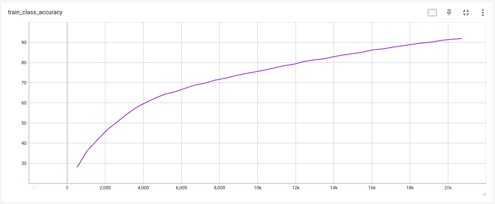
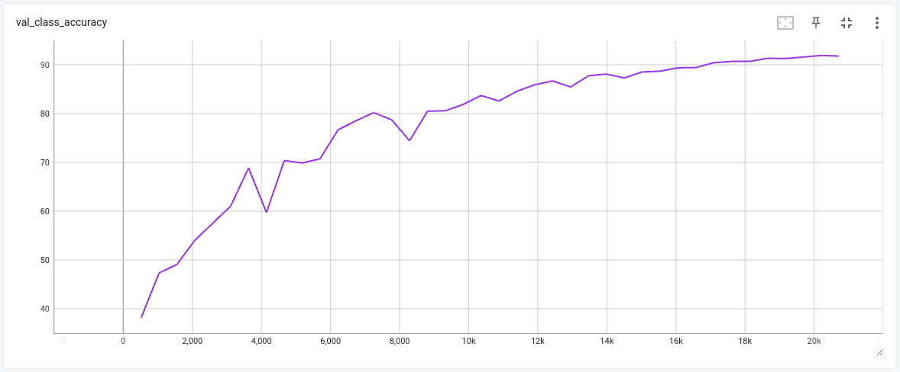
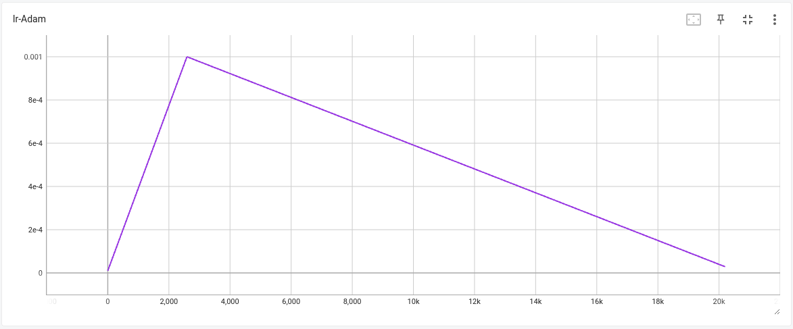

# Training YOLOv3 from Scratch

In this repository, we embark on a comprehensive journey to train a YOLOv3 model from scratch using the Pascal VOC dataset. The dataset encompasses a diverse set of 20 classes, including:

`"aeroplane," "bicycle," "bird," "boat," "bottle," "bus," "car," "cat," "chair," "cow," "diningtable," "dog," "horse," "motorbike," "person," "pottedplant," "sheep," "sofa," "train," and "tvmonitor."`

## Gradio App

Explore the deployed Gradio app for interactive demonstrations: [YOLOv3 Gradio App](https://huggingface.co/spaces/parrotletml/yolov3)

## Training Notebook

You can find details of the training notebook [here](./YOLOv3.ipynb).


## YOLOv3 Architecture and Loss

The YOLO (You Only Look Once) model architecture revolutionized object detection by offering a real-time, end-to-end approach. YOLOv3 is the third iteration, enhancing both speed and accuracy.

### YOLOv3 Anchor Boxes

Anchor boxes play a pivotal role in YOLOv3's ability to detect objects of varying sizes and shapes within an image. These pre-defined anchor boxes serve as reference templates that guide the model's predictions of object locations and dimensions. Anchor boxes allow YOLOv3 to handle different object scales and aspect ratios more effectively, enhancing the model's versatility and accuracy.

#### Multiple Object Scales

In YOLOv3, each grid cell is associated with a set of anchor boxes. These anchor boxes are strategically designed to capture objects of different scales. The concept of anchor boxes is particularly beneficial when dealing with images where objects may appear at varying distances from the camera. By employing multiple anchor boxes, YOLOv3 is capable of simultaneously detecting small, medium, and large objects within a single grid cell.

#### Aspect Ratios and Shapes

Each anchor box is characterized by its own aspect ratio and size. These attributes define the shape of the box. For instance, an anchor box with a higher aspect ratio may be better suited to capturing elongated objects like vehicles, while an anchor box with a lower aspect ratio could be optimized for detecting objects with a more square-like shape.

#### Predicting Bounding Boxes

For each anchor box assigned to a grid cell, YOLOv3 makes predictions about the object located within that grid cell. The model predicts four primary parameters for each anchor box:

1. **Center Coordinates (x, y)**: These coordinates represent the center point of the predicted bounding box within the grid cell.

2. **Width (w)**: The width of the predicted bounding box.

3. **Height (h)**: The height of the predicted bounding box.

4. **Objectness Score**: This score indicates how likely it is that an object exists within the predicted bounding box. It reflects the intersection over union (IoU) between the predicted box and the ground-truth box.

#### Incorporating Anchor Box Information

The anchor box information is crucial for both the training and inference stages. During training, YOLOv3 calculates the loss based on the predictions made by each anchor box. The presence of multiple anchor boxes ensures that the model can effectively handle objects of diverse scales and shapes. The loss optimization process guides the model to improve its predictions by minimizing the discrepancies between predicted and actual object attributes.

In summary, anchor boxes serve as a vital mechanism in YOLOv3 that empowers the model to detect objects across different scales and shapes. By incorporating these anchor boxes, YOLOv3 achieves remarkable accuracy and robustness in object detection tasks. The strategic selection of anchor box attributes influences the model's ability to identify objects with varying proportions, enhancing its applicability in real-world scenarios.


### Grid Division and Anchor Boxes
At its core, YOLOv3 employs a grid-based approach to divide the input image into regions. Each region, also known as a grid cell, is responsible for predicting a fixed number of bounding boxes. Importantly, YOLOv3 introduces anchor boxes, which are pre-defined boxes with distinct aspect ratios and scales. Each anchor box corresponds to a potential object's shape and size.

By utilizing multiple anchor boxes, YOLOv3 can accommodate various object configurations within a grid cell. Each anchor box is associated with a specific object scale, allowing the model to detect objects of differing proportions within a single cell.

### Bounding Box Prediction
For each anchor box within a grid cell, YOLOv3 predicts four crucial parameters: the bounding box's center coordinates (x, y), its width (w), and its height (h). These predictions are refined through training to minimize the discrepancies between predicted and ground-truth bounding boxes.

### Class Prediction
In conjunction with bounding box predictions, YOLOv3 assigns a probability distribution over the predefined classes to each anchor box. This class probability reflects the likelihood of the detected object belonging to a specific class within the bounding box. The model utilizes softmax activation to compute these class probabilities.

### Loss Function

The YOLOv3 loss function is a combination of several components: localization loss, objectness loss, and class loss. These components ensure that the model learns to accurately predict bounding boxes and class probabilities.

1. **Localization Loss (L_coord)**: This component penalizes the discrepancy between the predicted bounding box coordinates (x, y, width, height) and the ground-truth coordinates. It's computed using the mean squared error between the predicted and actual box coordinates.

2. **Objectness Loss (L_obj)**: The objectness loss measures how well the predicted bounding box overlaps with the ground-truth box. It encourages the model to predict high confidence scores for boxes that closely match the true objects. The loss term includes the logistic regression loss.

3. **Class Loss (L_cls)**: This loss ensures that the model accurately predicts the class of the object contained within the bounding box. It's computed using categorical cross-entropy loss.

The overall loss (L_total) is the sum of these components, and it's computed for each grid cell and anchor box. The loss function aims to balance the importance of different components while training the model.

### Loss Formula
The total loss (L_total) for a grid cell and anchor box is calculated using the following formula:


Where:

- ,\(\lambda_{obj}\),and\(\lambda_{cls}\)) are the coefficients that balance the impact of each loss component.
- ) is the localization loss.
- ) is the objectness loss.
- ) is the class loss.

This comprehensive loss function ensures that the YOLOv3 model learns to precisely identify and locate objects within images.
components.

## Model Training Approach

Our approach to model training involves a synergy of effective techniques:

1. **Utilizing PyTorch Lightning**: To harness the advantages of clean coding practices and optimal utilization of underlying hardware resources, we meticulously restructured the codebase to fully leverage the PyTorch Lightning framework.

2. **Multi-Image Size Training**: We employ a strategy of training the model on images of varying dimensions. This technique exposes the model to a diverse range of scales, enhancing its ability to generalize across different input sizes.

3. **Innovative Mosaic Technique**: By ingeniously fusing four images into mosaic-like tiles, we enable the model to simultaneously process contextual information from multiple images. This technique aids the model in learning from more comprehensive visual contexts.

4. **One Cycle Learning Rate Policy**: To expedite the training process and converge faster, we employ the One Cycle Learning Rate (LR) policy. This dynamic policy adjusts the learning rate during training, allowing for efficient navigation of the loss landscape.

## Tailoring for Different Image Scales

To adapt the model for different image scales, follow these steps:

1. Open the `config.py` file, a central hub for configuration.
2. Modify the `TARGET_IMAGE_SIZE` and `SA` values to your desired settings.
    - These values are multiplied by 32 to determine the actual image dimensions used in training.
3. The data loader is thoughtfully designed to manage various sizes and their associated anchors, streamlining the process for you.
4. The trainer component seamlessly integrates with the data loader, efficiently passing batches to the model and calculating associated losses.
5. Organize your data in a directory relative to the root of your training file, adhering to the PASCAL VOC format.

## Insightful Training Results

Here's a snapshot of the training results from the 39th epoch:

- **Epoch**: 39
- **Time Elapsed**: 4 minutes and 56 seconds
- **Iterations**: 518 iterations completed
- **Iteration Rate**: Approximately 1.75 iterations per second
- **Validation Loss**: 3.180
- **Validation Class Accuracy**: 91.20%
- **Validation No-Object Accuracy**: 96.80%
- **Validation Object Accuracy**: 92.20%
- **Training Loss**: 5.010
- **Training Class Accuracy**: 89.50%
- **Training No-Object Accuracy**: 93.20%
- **Training Object Accuracy**: 96.90

```
Epoch 39: 100%|██████████| 518/518 [04:56<00:00,  1.75it/s, v_num=308, val_loss=3.180, val_class_accuracy=91.20, val_no_obj_accuracy=96.80, val_obj_accuracy=92.20, train_loss=5.010, train_class_accuracy=89.50, train_no_obj_accuracy=93.20, train_obj_accuracy=96.90]
```


These metrics offer valuable insights into the training progress and the model's performance.

## Visualizing Training Progress

The provided graphs offer a visual representation of the training progress:

1. Training Class Accuracy (TCA):
    

2. Validation Class Accuracy (VCA):
    

3. Training Loss (TL):
    

4. Validation Loss (VL):
    

5. Learning Rate (LR):
    

## Mean Average Precision (mAP) Metrics

The mean average precision (mAP) values provide a comprehensive overview of model performance:

```
┏━━━━━━━━━━━━━━━━━━━━━━━━━━━┳━━━━━━━━━━━━━━━━━━━━━━━━━━━┓
┃        Test metric        ┃       DataLoader 0        ┃
┡━━━━━━━━━━━━━━━━━━━━━━━━━━━╇━━━━━━━━━━━━━━━━━━━━━━━━━━━┩
│         map_epoch         │     0.719588041305542     │
│    test_class_accuracy    │     95.84803771972656     │
│   test_no_obj_accuracy    │     96.89715576171875     │
│     test_obj_accuracy     │     94.87516784667969     │
└───────────────────────────┴───────────────────────────┘
```

In summary, our repository showcases an elaborate training journey, employing advanced techniques and strategies to mold the YOLOv3 model for optimal performance across different image scales. The provided results, graphs, and mAP values offer comprehensive insights into the model's training and evaluation.

